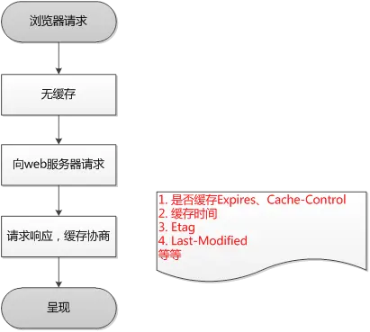
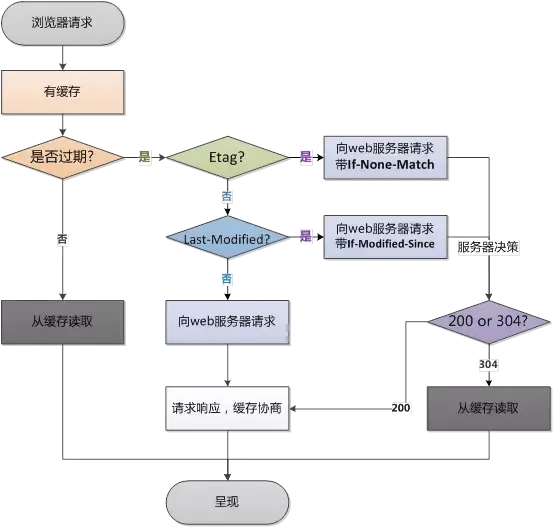

# 浏览器缓存过程

1.浏览器第一次加载资源，服务器返回200，浏览器将资源文件从服务器上请求下载下来，并把response header及该请求的返回时间一并缓存；

2.下一次加载资源时，先比较当前时间和上一次返回200时的时间差，如果没有超过cache-control设置的max-age，则没有过期，命中强缓存，不发请求直接从本地缓存读取该文件（如果浏览器不支持HTTP1.1，则用expires判断是否过期）；如果时间过期，则向服务器发送header带有If-None-Match和If-Modified-Since的请求

3.服务器收到请求后，优先根据Etag的值判断被请求的文件有没有做修改，Etag值一致则没有修改，命中协商缓存，返回304；如果不一致则有改动，直接返回新的资源文件带上新的Etag值并返回200；；

4.如果服务器收到的请求没有Etag值，则将If-Modified-Since和被请求文件的最后修改时间做比对，一致则命中协商缓存，返回304；不一致则返回新的last-modified和文件并返回200；

**第一次**

**第二次**

## ETag（实体标签）和 Last-Modified（上次修改时间）都是 HTTP 协议中用于缓存控制的头部字段，但它们在实现机制和应用场景上有一些区别。

**ETag（实体标签**
- 机制：ETag 是由服务器为每个资源生成的唯一标识符，通常是资源内容的哈希值或者其他可以唯一标识资源版本的字符串。
- 用途：客户端在发起请求时，可以将上一次请求服务器返回的 ETag 值通过 If-None-Match 头部字段发送回服务器，以检查资源是否发生了变化。
- 优点：ETag 可以更精确地判断资源是否发生了变化，因为它不仅依赖于文件的修改时间，还可以包括内容的其他特征。
- 缺点：生成 ETag 需要服务器计算资源的哈希值或其他标识符，可能会增加服务器的负担。

**Last-Modified（上次修改时间）**

- 机制：Last-Modified 是服务器返回的一个标准的 HTTP 头部字段，指示资源在服务器上的最后修改时间。
- 用途：客户端在发起请求时，可以通过 If-Modified-Since 头部字段将上一次请求服务器返回的 Last-Modified 值发送回服务器，以检查资源是否在此时间点之后被修改过。
- 优点：Last-Modified 是服务器自动生成的，不需要额外的计算，对于一些静态资源很方便。
- 缺点：有时候文件内容并没有变化，但是修改时间却更新了（例如文件被重新上传），这会导致不必要的资源下载。
区别总结
- 精确度：ETag 更加精确，可以通过内容的哈希值来判断资源是否变化，而 Last-Modified 只能通过时间戳来判断。
- 性能：Last-Modified 相对简单，不会增加服务器负担，但可能会因为时间戳更新而导致不必要的资源传输。
- 优先级：在实现缓存控制时，浏览器通常优先使用 ETag，如果服务器没有提供 ETag，则会使用 Last-Modified。

综上所述，ETag 和 Last-Modified 都是 HTTP 缓存控制的重要手段，可以根据具体场景选择使用，或者结合使用以提高缓存命中率和效率。